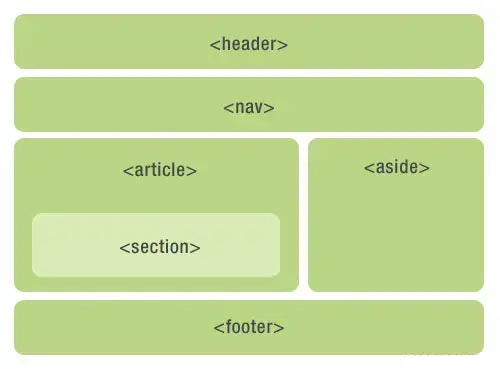
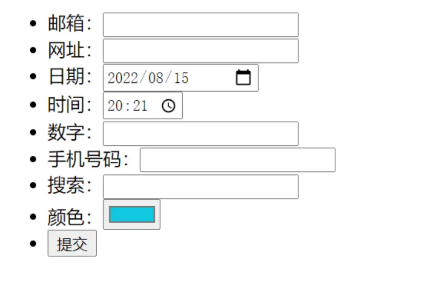
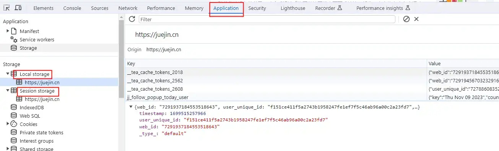

# 简述Html5

HTML 的最新稳定版本，HTML5 将 HTML 从用于构造一个文档的一个简单标记，到一个完整的应用程序开发平台。除其他功能外，HTML5
还包括新元素和用于增强存储、多媒体和硬件访问的JavaScript APIs 。

## 语义化标签

以前布局，我们基本都用 div 来做，div 对于搜索引擎来说是没有语义的

HTML5 新增了语义化标签：

````
<header> ：头部标签
<nav> ：导航标签
<article> ：内容标签
<section> ：定义文档某个区域，可看成一个大的 div
<aside> ：侧边栏标签
<footer> ：尾部标签
````

result

````
<!DOCTYPE html>
<html lang="en">
<head>
    <meta charset="UTF-8">
    <meta http-equiv="X-UA-Compatible" content="IE=edge">
    <meta name="viewport" content="width=device-width, initial-scale=1.0">
    <title>语义化标签</title>
</head>    
<style>
    body {
        margin: 0;
        padding: 0;
        width: 340px;
    }

    header, nav {
        height: 45px;
        line-height: 45px;
        background-color: #BAD585;
        border-radius: 6px;
        margin-bottom: 10px;
        text-align: center;
    }

    article {
        float: left;
        width: 190px;
        height: 160px;
        background-color: #BAD585;
        border-radius: 6px;
        margin: 0 10px 10px 0;
        padding: 20px 0 0 0;
        text-align: center;
        box-sizing: border-box;
    }

    article section {
        width: 170px;
        height: 40px;
        background-color: #D9EBB7;
        border-radius: 6px;
        text-align: center;
        margin: 30px auto 0 auto;
    }

    aside {
        float: left;
        width: 140px;
        height: 160px;
        background-color: #BAD585;
        padding: 20px 0 0 0;
        border-radius: 6px;
        margin-bottom: 10px;
        text-align: center;
        box-sizing: border-box;
    }

    footer {
        width: 100%;
        height: 45px;
        line-height: 45px;
        background-color: #BAD585;
        border-radius: 6px;
        margin-bottom: 10px;
        text-align: center;
        float: left;
    }
</style>

<body>
<header>&lt;header&gt;</header>
<nav>&lt;nav&gt;</nav>
<article>
    &lt;article&gt;
    <section>&lt;section&gt;</section>
</article>
<aside>&lt;aside&gt;</aside>
<footer>&lt;footer&gt;</footer>
</body>
</html>
````



注意：

- 在没有 css 时，页面也能呈现较好的内容结构
- SEO 友好，爬虫依赖标签来确定上下文及关键字的权重<br>
- 这种语义化标准主要是针对搜索引擎的<br>
- 这些新标签页面中可以使用多次<br>
- 在 IE9 中，需要把这些元素转换为块级元素<br>
- 其实，我们移动端更喜欢使用这些标签<br>
- 可维护性，可读性；看到对应的标签就知道大致包含的内容了，维护起来自然也方便许多

## 多媒体标签

新增的多媒体标签主要包含两个：

1. 音频：```<audio>```
2. 视频：```<video>```

使用它们可以很方便地在页面中嵌入音频和视频，而不再去使用 flash 和其他浏览器插件

**video**

````
<video src="文件地址" controls="controls"></video>

````

考虑到兼容性，可以这样写

````
<video controls="controls" width="300">
	<source src="movie.ogg" type="video/ogg" >
	<source src="movie.mp4" type="video/mp4" >
	您的浏览器暂不支持 <video> 标签播放视频
</video>

````

result：

````
<!DOCTYPE html>
<html lang="en">
<head>
    <meta charset="UTF-8">
    <meta http-equiv="X-UA-Compatible" content="IE=edge">
    <meta name="viewport" content="width=device-width, initial-scale=1.0">
    <title>video标签</title>
</head>
<style>
   video {
     width: 100%;
   }
</style>

<body>
    <video src="https://cdn.cnbj1.fds.api.mi-img.com/product-images/mi12sltli3b/video1-2.mp4" autoplay="autoplay"
        muted="muted" controls="controls" loop="loop"></video>
</body>

</html>

````

**audio**

````
<audio src="文件地址" controls="controls"></audio >
````

考虑到兼容性，可以这样写

````
<audio controls="controls" width="300">
	<source src="music.mp3" type="audio/mpeg" >
	<source src="music.ogg" type="audio/ogg" >
	您的浏览器暂不支持 <audio > 标签播放音频
</audio >
````

result：

````
<!DOCTYPE html>
<html lang="en">
<head>
    <meta charset="UTF-8">
    <meta http-equiv="X-UA-Compatible" content="IE=edge">
    <meta name="viewport" content="width=device-width, initial-scale=1.0">
    <title>音频标签audio</title>
</head>

<body>
    <h3>Shadow of the sun</h3>
    <audio
        src="https://webfs.ali.kugou.com/202208151945/861843bcad9089cb46825a6ff2a40868/G242/M09/1B/01/0pQEAF-NTZKAP-HiACOcMEe9M0M964.mp3"
        autoplay="autoplay" controls="controls">
    </audio>
</body>

</html>
````

温馨提示：谷歌浏览器把自动播放禁止了，目前还无法解决，等到学习 js 才能解决

多媒体标签总结：

- 音频标签和视频标签使用方式基本一致<br>
- 浏览器支持情况不同<br>
- 谷歌浏览器把视频和音频自动播放禁止了<br>
- 我们可以给视频标签添加 muted 属性来静音播放视频，音频不可以（可以通过 js 解决）<br>
- 视频标签是重点，我们经常设置自动播放，不使用 controls 控件、循环和设置大小属性<br>

## 新增的input类型

为了让开发者更加方便地创建各种类型的表单控件，同时也能更好地满足用户的输入需求，HTML5 对 input 的 type 进行了拓展，主要有以下常用类型

- color 色值选择器
- date、datetime、month、week、time 等时间相关的选择；在对样式要求不高时，可以作为选择
- email 地址输入域
- search 搜索域，与 datalist 配合使用
- tel 电话号码输入
- number 数字输入
- range 范围选择器

````
<!DOCTYPE html>
<html lang="en">
<head>
    <meta charset="UTF-8">
    <meta http-equiv="X-UA-Compatible" content="IE=edge">
    <meta name="viewport" content="width=device-width, initial-scale=1.0">
    <title>新增input表单</title>
</head>

<body>
    <form action="">
        <ul>
            <li>邮箱：<input type="email"></li>
            <li>网址：<input type="url"></li>
            <li>日期：<input type="date"></li>
            <li>时间：<input type="time"></li>
            <li>数字：<input type="number"></li>
            <li>手机号码：<input type="tel"></li>
            <li>搜索：<input type="search"></li>
            <li>颜色：<input type="color"></li>
            <li><input type="submit" value="提交"></li>
        </ul>
    </form>
</body>
</html>
````



重点记住：number、tel、search 这三个

## 新增的表单属性

可以通过以下设置方式修改 placeholder 里面的字体颜色：

````
input::placeholder {
	color: cyan;
}
````

result：

````
<!DOCTYPE html>
<html lang="en">
<head>
    <meta charset="UTF-8">
    <meta http-equiv="X-UA-Compatible" content="IE=edge">
    <meta name="viewport" content="width=device-width, initial-scale=1.0">
    <title>新增表单属性</title>
    <style>
        input::placeholder {
            color: cyan;
        }
    </style>
</head>

<body>
    <form action="">
        <input type="search" name="" id="" required="required" placeholder="请输入搜索内容" autofocus="autofocus"
            autocomplete="off">
        <input type="file" name="" id="" multiple="multiple">
        <input type="submit" value="提交">
    </form>
</body>
</html>
````


## Web Storage

HTML5 新增了 localStorage、sessionStorage 用来缓存数据；使用时非常简单

````
localStorage.setItem("name", "value");
localStorage.getItem("name"); // => 'value'
localStorage.removeItem("name");
localStorage.clear(); // 删除所有数据

sessionStorage.setItem("name", "value");
sessionStorage.setItem("name");
sessionStorage.setItem("name");
sessionStorage.clear();
````

### 与 cookie 对比
---
在这之前，我们一般通过 cookie 来存储数据，限制非常严重

- cookie 只有 4k，而 Web Storage 约为 5M
- cookie 中的信息会发送到服务器，过大会造成负担；老项目的性能优化，cookie 的缩减是很重要的一项
- 操作简单，cookie 是一串字符串，每次都需要从字符串中解析，尽管我们可以封装 cookieUtils，但 Web Storage 则天然具有简单的 API
- 查询快，如上 cookie 需要解析字符串，而 Web Storage 则使用散列存储，快速查询

### localStorage 与 sessionStorage
---
浏览器可以通过 localStorage 与 sessionStorage 安全地存储键值对；内容会保存在同一个源下的 Storage 对象中



localStorage 中存储的数据除非主动清除，如清除浏览器缓存、上图 Application 清除 Storage、调用 clear 代码清除；否则会一直存在。这也就意味着关闭浏览器后再次打开，仍然可以缓存，适合持久化缓存应用场景

sessionStorage 中的数据则和会话窗口有关，多个 tab 栏中可以公用，但一旦浏览器关闭，则数据清除，适合临时存储登录 token

### 监听变化
---
当 Web Storage 发生变化时，会触发 storage 事件，回调参数中会返回变更的存储值

````
window.addEventListener('storage', (event) => {
  // 来自清除缓存，变更 cookie
  if (e.key == null) {
    docCookies.removeItem('pageLoaded');
    docCookies.removeItem('detailLoaded')
  }
})
````
这个事件可以用来配合 css inline 进行极致的性能优化（适用于 PHP 的静态模版渲染、SSR），如果是第一次加载，则将 css 的内容放到 html 的 style 中；如果 css 缓存了，则从缓存中获取通过 link 加载 css，配合着将脚本放到 body 底部，可以做到首屏渲染无需请求任何资源

注意：这里要求 css 的内容不能太大，如果将 css 以 style 形式放到 html 中，对 Doc 文档的 fetch 影响较大，则得不偿失（一般情况下，几十 KB 的大小，对 html 的下载时间的影响都不大）

### 无痕模式下不可用
---
浏览器会在无痕模式下禁用 Web Storage，使用时需要进行可用性检测

<code>typeof Storage !== "undefined"</code>

### 大小问题
---
尽管 Web Storage 拥有 5M 左右的大小，但如果存储过于大量的 json 数据，依然非常容易满；而在存储接近满时，性能会非常差，很容易造成移动端卡顿

### indexDB 与 localforage
---
使用 indexDB 可以很好的解决上述两个问题，它是一种类似数据库操作的存储结构，具有事务处理的特性，非常适合存储表格形式的数据，使用可参考 MDN 文档

由于 indexDB 的 API 非常繁琐，推荐使用封装好的 JavaScript 库，如 localforage

localforage 有一个优雅降级策略，若浏览器不支持 IndexedDB 或 WebSQL，则使用 localStorage

### 不支持跨域
---
注意，Web Storage 和 indexDB 存储的内容会保存在同一个 Origin 下，一旦跨域，就无法访问

如果需要跨域访问

- 如果是自己内部站点，拥有相同二级域，可以通过 iframe + postMessage 来进行通讯
- 另一种就是通过 WebSocket 长连接

### 安全考虑

避免将敏感数据存储在 Storage 中（如用户手机号等），容易受到攻击

## Web Worker

一句话，Web Worker 让 JavaScript 拥有了多线程处理的能力，简直是牛逼 plus

我们可以可以抽离一部分功能到 Web Worker 中，如复杂计算、处理，在结束后，通过 postMessage 并携带结果返回给主线程

### 使用
---
主页面 js

````
// 主线程中初始化Web Worker
let myWorker = new Worker('worker.js');

// 接收Worker消息事件
myWorker.addEventListener(
  'message',
  function (e) {
    console.log('Received message ' + e.data);
  },
  false
);

// 发送消息给Worker
myWorker.postMessage([42, 1337]);
````

worker.js

````
self.addEventListener('message', function(e) {
  let numbers = e.data;
  let sum = numbers.reduce(function(a, b) {
      return a + b;
  }, 0);
  self.postMessage(sum);
});
````
我们就完成一个运行在后台的加法计算 worker 了

### 优缺点
---
优点：Web Worker拥有独立的内存空间和线程池，即使处理出错或内存溢出，也不会阻塞主线程；同时充分利用多核进行计算任务，极大提升页面性能

缺点：不具备 DOM 操作能力，什么 window、document 统统不能操作，可以理解，因为在多线程环境下如果随意访问DOM，你操作一下，它操作一下，以谁为准呢？所以浏览器并未开放这个权限，如果需要操作 DOM，在主线程去操作